
<big><big><big><big>计算机网络网络层实验1报告</big></big></big></big>

<big><big>马成 20307130112</big></big>

## 用traceroute发送大小为56 bytes的UDP包 

### 选择第一个发送的 UDP 包

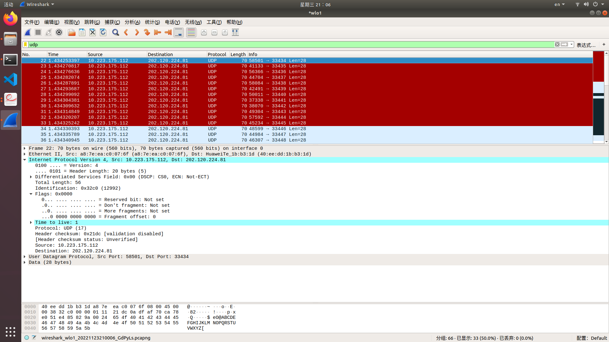

1. 发送端的IP地址?

   10.233.175.112

2. 在IP header中，上层协议的数值是多少?

   UDP(17)

3. IP header有多少bytes? IP数据报数据载荷有多少bytes? 

   IP header有20bytes，有效数据载荷36bytes，数据段28bytes 

4. 该IP数据报是否分片

   否，此时flag为0

### 观察连续的UDP包（穿插其他包）

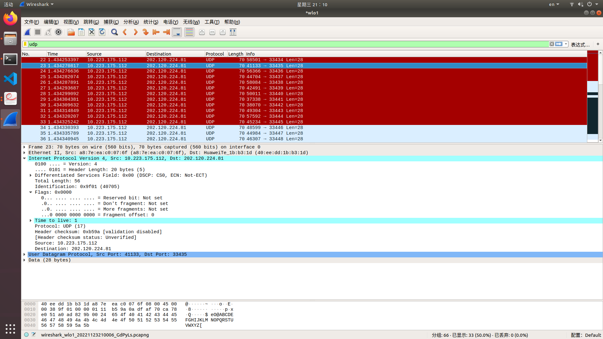
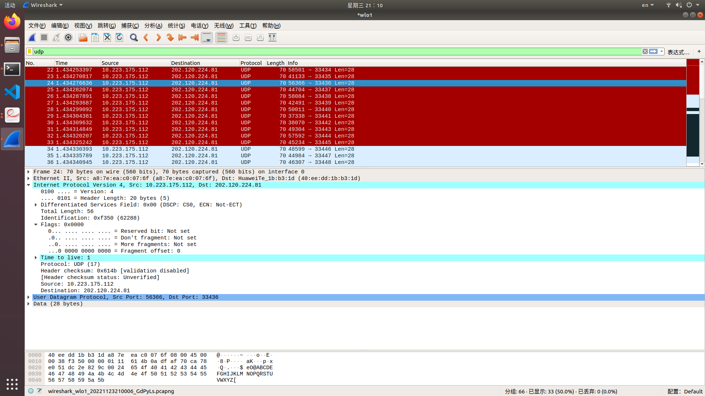
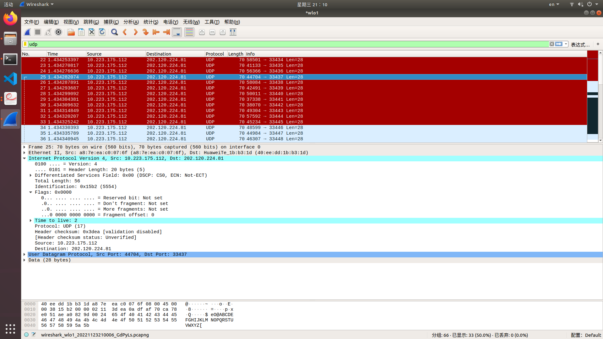
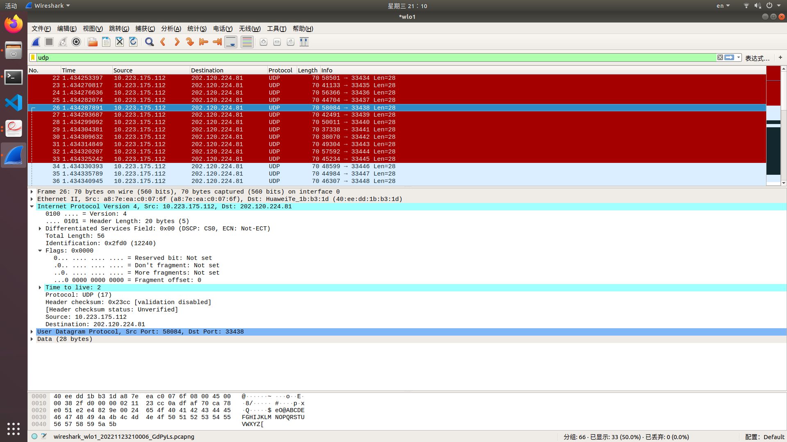

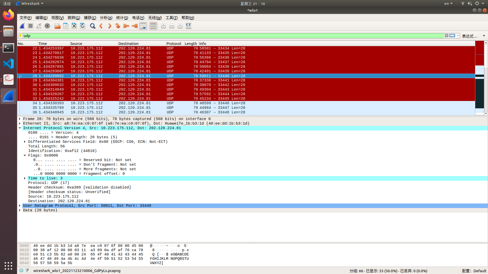

1. IP数据报中哪些字段不断变化，哪些保持不变

   Identification和Checksum，Time to Live在变化。
   而其余的未改变

2. 为什么有些字段不断变化，为什么有些不变

   1. 变化：
      - Identifications：生成一个数据报的时候会产生一个随机的Identification编号，除非这些数据报是由一个数据报分片得到的，一般情况下不会有相同Identification
      - CheckSum：用于检查路由器收到的IP报文是否有bit传输错误，因此当整个报文的其他部分有细微的不同checksum就会不同
      - TTL：traceroute的原理就是发送不同TTL的报文用来收到每一条设备的超时信息工作的，因此会收到不同TTL的IP报文
   2. 不变（感觉没有什么要说的，我挑几个说说）：
      - source和destination：发送源地址和目标地址肯定不变
      - protocol：都是使用的UDP
      - Flags：仅发送大小为56bytes的报文，都不需要分片

3. 列出连续IP数据报中的标识序列

   0x32c0

   0x9f01

   0xf350

   0x15b2

   0x2fb0

   0xaf12

   可以看出其实没有什么规律

### 观察收到的第一个TTL-exceeded replies

1. 标识字段与TTL字段分别是多少？

   标识字段：0x4128 TTL:254

2. 收到的所有TTL-exceeded replies中，这两个字段是否不变？为什么？

   不是

   - 表示字段会改变，因为这些数据报不是一个数据报的分片关系，标识符会随机分配。
   - TTL如果是同一跳传回来的reply会一样，否则就会不一样

   

   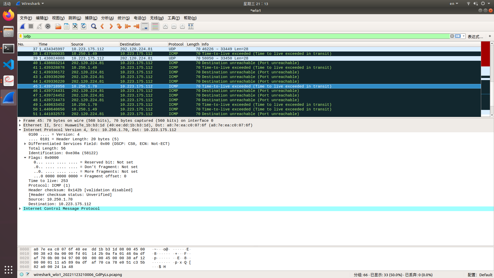

   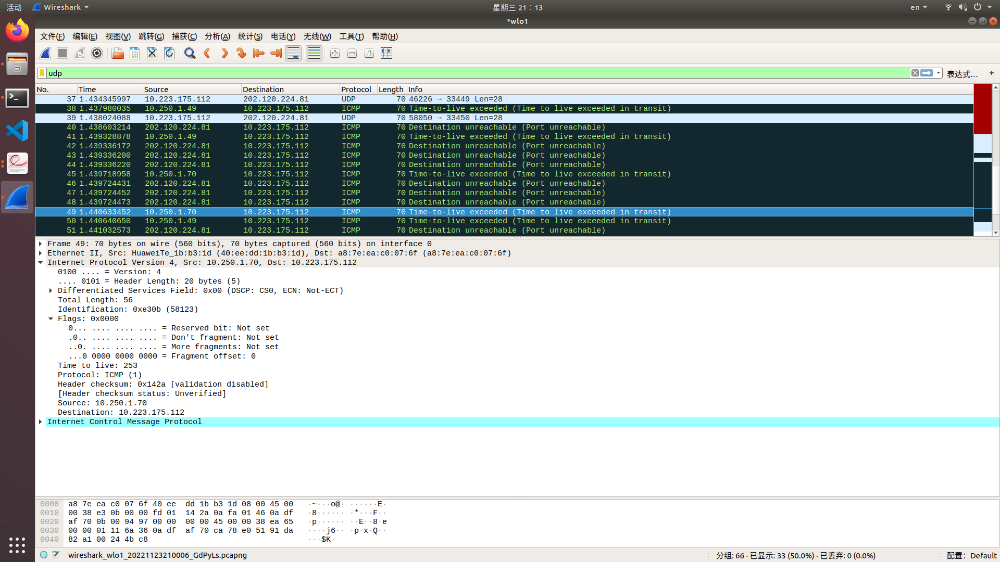

## 用traceroute发送大小为2000 bytes的UDP包

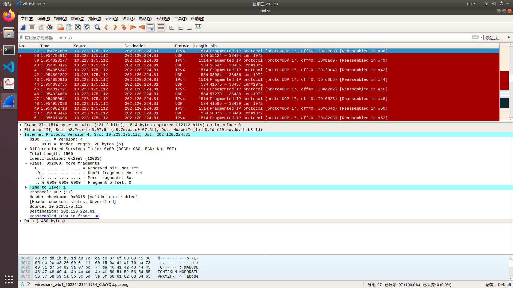

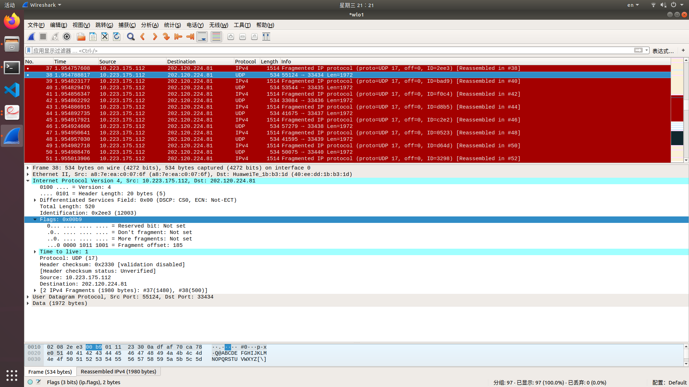

1. 找到第一个IP数据报，如何判断是否被分片？如何判断是否是第一个分片？这个数据报大小是？

   如果flag不为0就是分片了，如果Fragment offset是0就是第一个分片，这个数据报大小为1500bytes

2. 找到第二个IP数据报，如何判断其不是第一个分片？是否后面还有更多分片？

   如果Fragment offset不是0就不是第一个分片，后面没有更多的分片了因为More fragments（标志位）那里是0

3. 第一个和第二个IP数据报中，IP header的哪些字段发生了变化？

   - Total Length：第一个数据报占到了最大的限制，第二个数据报没有因此不同
   - Flags：虽然都分片了，但是在标志位和偏移量上还是会不同，因为这是两个不同的分片
   - checksum：两个数据报内容不同，检验和自然不同

## 用traceroute发送大小为3500 bytes的UDP包

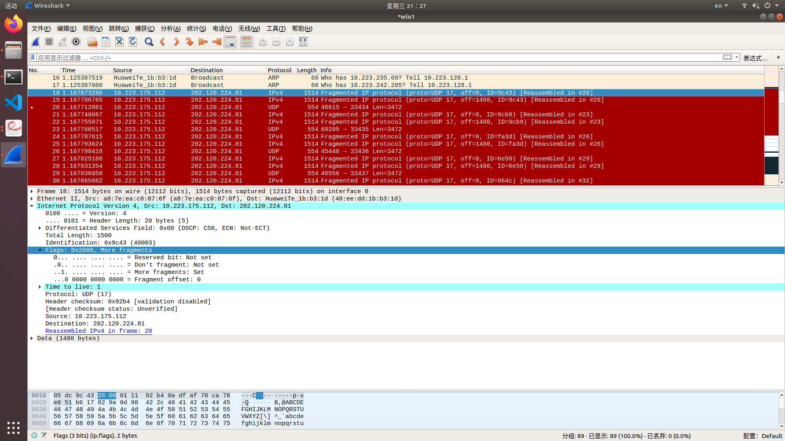

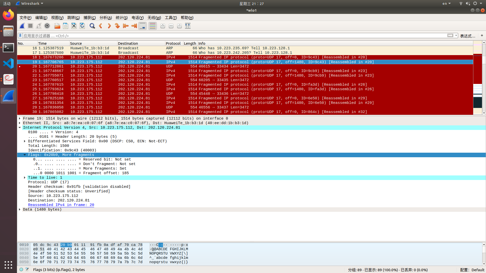

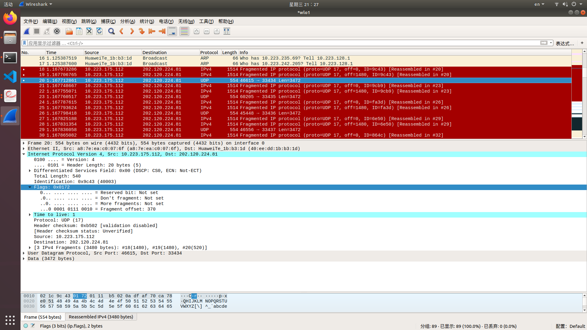

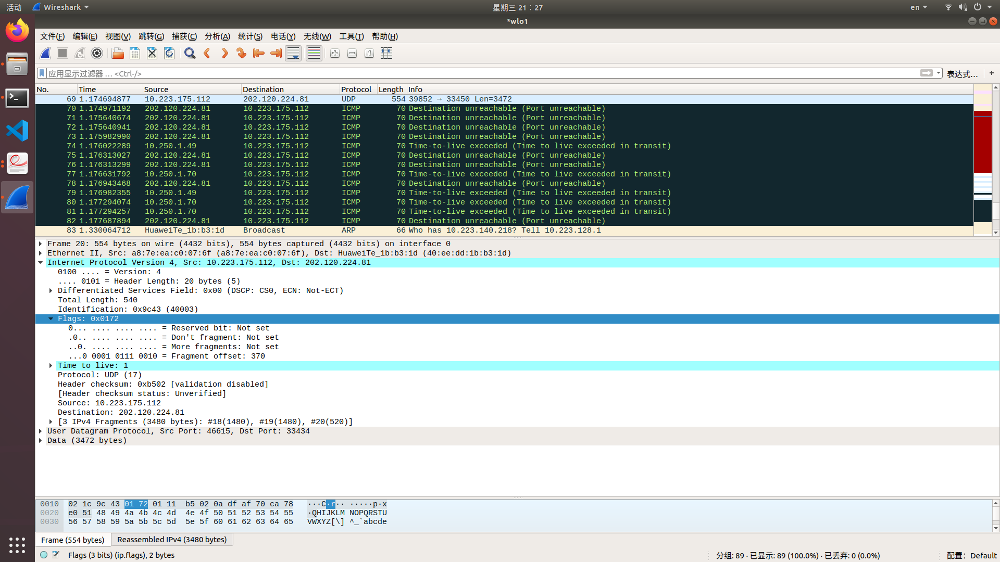

1. 生成了多少个分片？

   3个分片

2. 这些分片中，IP header的哪些字段发生了变化？

   - Total Length：第一二个数据报占到了最大的限制他们俩相同，第三个数据报没有因此不同
   - Flags：虽然都分片了，但是标志位第一第二个数据报相同，第三个不同和偏移量均不同，因为这是三个不同的分片
   - checksum：两个数据报内容不同，检验和自然不同

3. 一个UDP包收到多少个TTL exceeded?

   从图中可以看到一个UDP收到一个TTL exceeded
